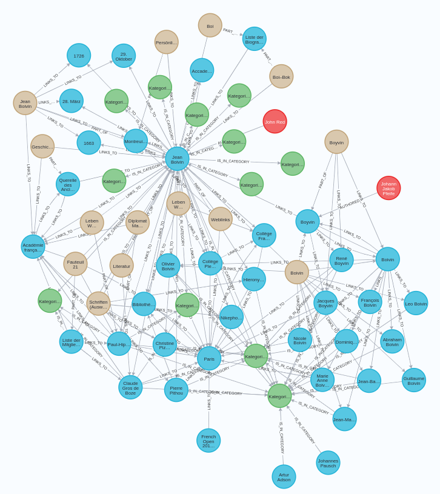
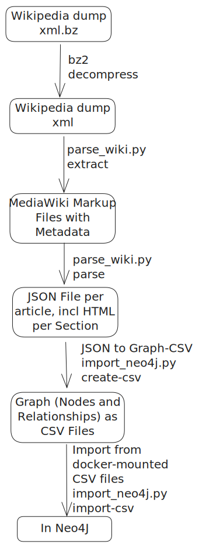

wiki2graph: Wikipedia 2 Neo4J
=============================

This tool builds a graph in neo4j from a wiki-dump.


## Overview

The idea is to download the dump, parse it to get an easier to work with json,
convert it do different CSV files and import them into neo4j.

Builds a graph with nodes `Article`, `Author`, `Category`, `Section` and relationships `AUTHORED`, `IS_IN_CATEGORY`, `LINKS_TO`, `PART_OF` 


### Features:

- Extracts wikimedia-markup-articles from a dewiki-dump. 
   - The first line of the extracted articles is JSON with some metadata about the article
- Parses the wikimedia-markup-files, converts them additionally to HTML, adds metadata (like outgoing links) and makes it easy to use via JSON-files. One file per article.
- Converts these JSON files to CSV-files, which can be importet to Neo4J
- Handles the import to Neo4J from CSV
- Creates nodes of types: Article, Author, Category, Section
- Creates relationships of types: AUTHORED, IS_IN_CATEGORY, LINKS_TO, PART_OF 


There are 23 Million Nodes and 224 Million Relationships (see below for details). 




## Is it alive?

This is a 1-time script for myself. 
Feel free to use it and contribute changes.

Limitations:
- I am not 100% sure, that every article makes it through the pipeline, as I just skip errors. I only need some graph with content, so a few lost articles did not matter to me. 
- In step 1, there may be more metadata you want.
- You may want to add other/more properties to the graph. To do this, change the CSV-creation script and the cyper queries in `import_neo4j.py`
- ... (I did not think too hard about the limitations)

That said, the scripts should work fine for you if you just need a graph with most of Wikipedia in Neo4J.

## What these scripts do?

- Take a wiki-dump file (which you can download)
- Extract the media-wiki-markup files (and add metadata as JSON in the first line)
- Parse these into easy-to-use JSON files and convert the markup to HTML.
- Create a graph from the JSON-Files as CSV-Files, ready to import to a graph-DB.
- Import the CSV-Files to neo4j by mounting them into the docker-container and running cypher-import commands.

These are the steps.



## Download a dump

I tested everything with the german wikidump (`dewiki`)

1. Go to this site: https://dumps.wikimedia.org/dewiki/
2. Select something except latest. For example https://dumps.wikimedia.org/dewiki/20240901/ but you probably want a newer one
3. Check, that the status is "done". Click on the download link, e.g. dewiki-20240901-pages-articles-multistream.xml.bz2
   This is around 7GB big.

## Parse the Wiki Dump

Use poetry to enter an virtual-env and install the dependencies.

1. Go to the root of this project
2. Extract the bz2, so that you have an xml file
2. `python3 wiki2graph/parse_wiki.py extract ~/Downloads/dewiki-20240820-pages-articles-multistream.xml data/wiki`
   This takes around 18 Minutes. It extracts the mediawiki-markup into seperate files (in buckets) in `data/wiki`. 
   Look at `data/wiki/000/1970.wiki`. The first line is some metadata in JSON, the rest is the content
3. `python3 wiki2graph/parse_wiki.py parse data/wiki data/wiki_json --processes=-1`
   This takes around 1-2 hours. It parses the 5 Mio articles (2.9 Mio Main-Articles, the rest is stuff like Categories, Maintainence stuff, etc.).
   Not all articles can be converted to HTML, which is printed while converting. 
   If you set `--processes=-1` all cores are used. I get around 1000it/s


### Note on article-types

Articles can be very different. Most of them are main articles (a normal article which
you would expect when browsing). But they can also articles like categories or internal 
articles for maintainence, e.g. internal discussions. You can distinguish them by 
namespace. To get a list of the different namespaces, give the variable `namespaces` in `wiki2graph/parse_wiki.py` a look.

## Import Articles to neo4j

To bring it to neo4j we create CSVs and import them. This is much faster. 

Note: Creating an index in neo4j first makes everything 10-40x faster!

1. `python3 wiki2graph/import_neo4j.py create-csv data/wiki_json data/csv` 
   Takes the extracted JSON files. For every bucket, it creates the CSV files for the graph database. 
   This is the nodes and relationships in csv-files to import into neo4j. Takes around 2 Minutes. 
2. `docker-compose up -d` 
   Start neo4j and mount the csv-directory (see the `docker-compose.yaml`)
   Double-check, that the mount-path in the file `./data/csv:` is correct.
3. Refresh `http://localhost:7474/` and wait until neo4j is read. As set in the 
   `docker-compose.yaml`, username/password is `neo4j/password`
   It is important that you follow the schema:
   `./<relative path to csv dir>:/import/<relative path to csv dir>`
4. `python3 wiki2graph/import_neo4j.py import-csv data/csv`
   This performs multiple steps, which you can check in `wiki2graph/import_neo4j.py` `import_csv` (check the `click.echo`)
   This takes around 56:00
   (3min for the articles, <1min for authors, 2:30 Minutes for the links between authors and articles, around 45min for the links betweenthe articles)
   You can check the progress on the neo4j web-ui.
   In the end, you should have (for the german wiki 3.7mio articles and 85.7mio relationhsips)

Note: Why CSV? You could add them directly from JSON, but it seemed much slower. Also with CSV, I have a good checkpoint on error. 

## Known issues

- In the json, the links to the specific sections are removed (somewhere?), thus there are not links from sections to other sections in the graph (and in `section_to_section_links.csv`).
- For links between two articles, I could store how many links there are. Often multiple sections link to the same article, thus the connection is stroner. I need to add this as property to the relationship.
- Depends on german. For example, the workd `kategorie` is searched for, not `category`. This has to be configurable to support other languages.
- The first section is called `Introduction`. This is english, thus not consitent. Also, It should be the name of the article.
- There are common sections at the bottom, which you may want to filter out, like weblinks, etc. To be able to filter them out, they need a property in the graph which classifiy them.


## Final Graph / Numbers

- 23 Million Nodes
   -  3.246.703 Articles (Meta-Articles like Files, etc). dewiki has around 2.8m "real" articles
   -    124.552 Authors (Only the author last edited an article is stored!)
   -    412.446 Categories
   - 19.259.613 Sections (An article consits of many sections)
- 224 Million Relationships
   -   3.246.703 :AUTHORED
   -  11.035.693 :IS_IN_CATEGORY Article is in Category
   - 190.769.782 :LINKS_TO Either Article links to Article, Article links to Section, Section links to Article, Section links to Section
   -  19.259.613 :PART_OF Section is part of Article
- I have importet this on a machine with:
   - 15.3 GB available RAM
   - CPU (`lscpu`):
      - 13th Gen Intel(R) Core(TM) i5-13500H 
      - Threads per core 2, Cores per socket 12, sockets 1
      - CPU family 6, model 186 (whatever this means)
      - MaxMHz: 4700,000
   - Import takes around 9-10 hours (7 hours CSV import, 2h preprocessing (estimated from memory))
- Neo4j takes 1.1GB of RAM while running this graph
- Neo4j Docker Volume Size on Disk: 18GB

## Recipes


### Reset Database

Delete docker-volume database

```
docker-compose down -v 
docker-compose up -d
```

Refresh `http://localhost:7474/` until available, then start the script.


### Reset/Cleanup intermediate files

If you store them in the directory `data/` (see your docker-compose, what you mount)

```
rm data/ -r
```
